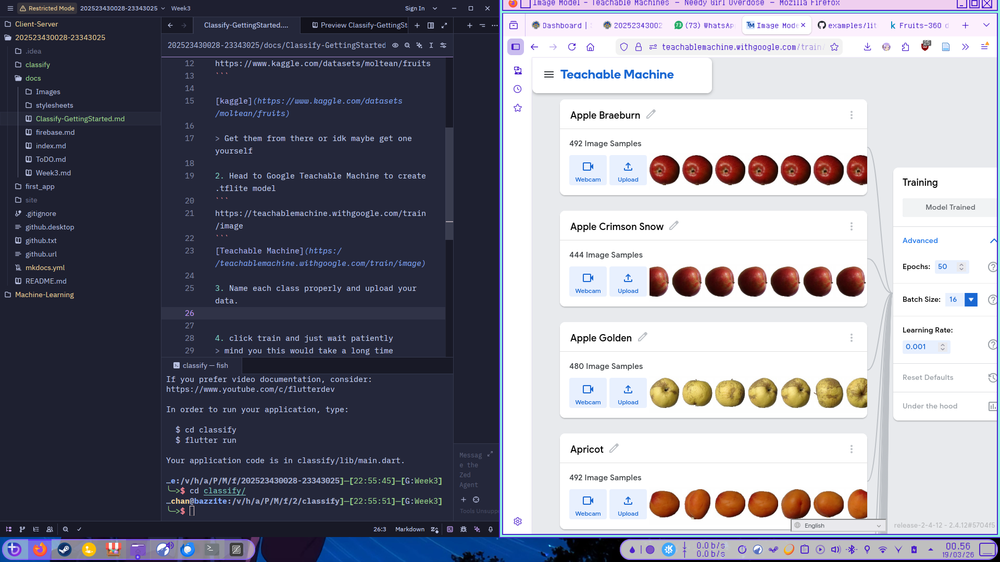
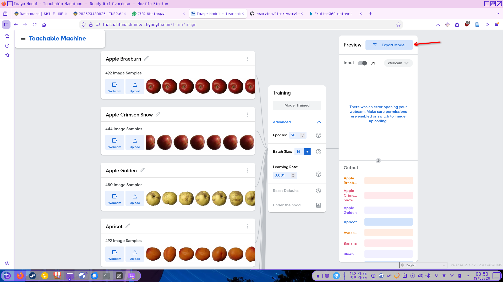
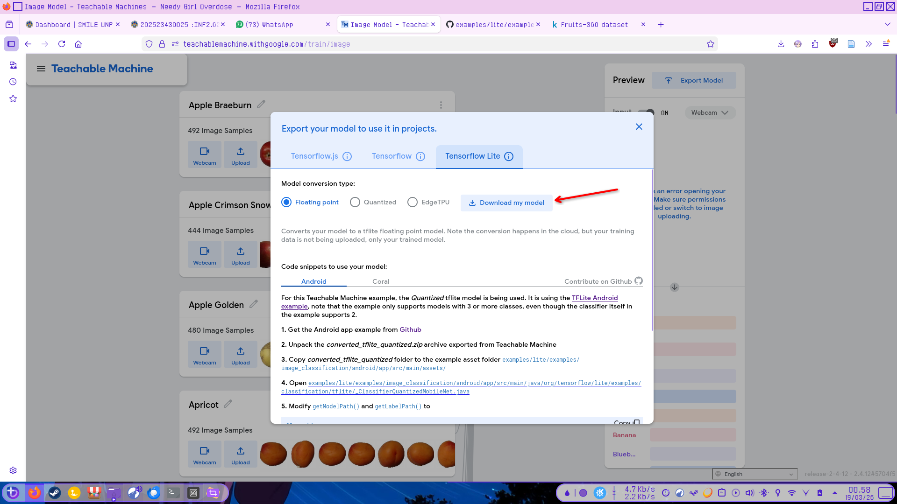

## Getting started

Since this assignment need to use Teachable machine then that mean we are creating our own model

--- 

### Getting the model


1. first step is obviously getting the dataset, feel free to pick any theme e.g. fruit 
```
https://www.kaggle.com/datasets/moltean/fruits
```

[kaggle](https://www.kaggle.com/datasets/moltean/fruits)

> Get them from there or idk maybe get one yourself

2. Head to Google Teachable Machine to create .tflite model
```
https://teachablemachine.withgoogle.com/train/image
```
[Teachable Machine](https://teachablemachine.withgoogle.com/train/image)

3. Name each class properly and upload your data.  
 

4. click train and just wait patiently
> mind you this would take a long time dependent on your data

5. Export model to tflite
 

6. Download the model

